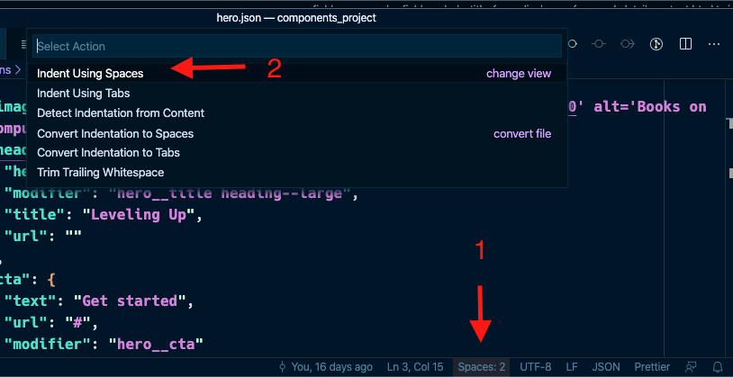
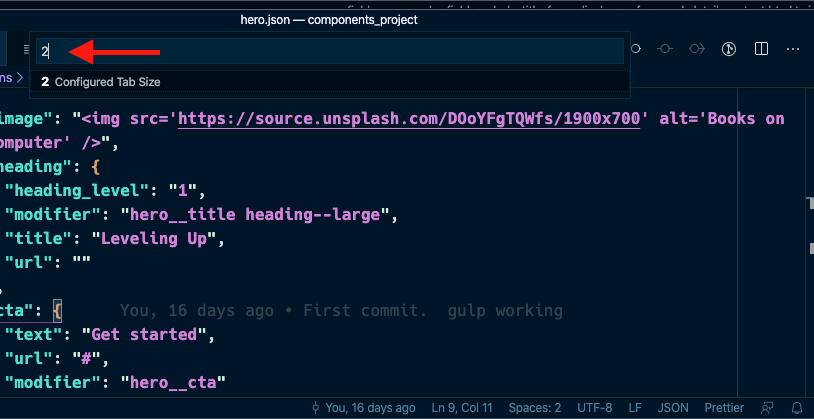

# JSON Basics

### What is JSON?

JavaScript Object Notation \(JSON\) is a standard text-based format for representing structured data. In the context of this training we will use JSON to write dummy content for our components.  This content can also be real content if you have it available.

### Why JSON?

On a typical website, someone, most likely a content editor, creates content by filling out a form.  For example, the Content Editor wants to create a Landing Page.  The landing page form has several fields where content is entered \(title, image, body, link, etc.\).  The Content Editor will fill in all the fields then save the page so it can be available on the website.  Think of JSON as the Landing Page form where we identify all the fields we need to crate the landing page or an individual component.  See the next topic for an example:

### Data Structure

JSON uses a `key` \| `value` pair format that makes writing and reading JSON a relatively easy task. The type of data you can use in JSON include `strings` \(plain text\), `numbers`, `arrays` \(a collection of items\), b`oolean` \(true or false\), and more. This allows you to construct a data hierarchy, like so:

```yaml
{
  "name": "John Smith",
  "email": "jsmith@example.com"
  "active": true,
  "social_networks": [
    {
      "name": "facebook",
      "url": "http://facebook.com"
    },
    {
      "name": "twitter",
      "url": "http://twitter.com"
    }
  ]
}
```

* The code above shows how each key to the left of the colon, has a value to the right of the colon.
* It also shows the different types of data we can store.  For example, `"name"` is a string type of data where you can enter any string of text and numbers.  `"active"` only accepts `true` or `false` as it is a boolean type of data field.  Finally we see that `"social_networks"` is an array which contains a collection of items within it.  Arrays can be visually identified by the square brackets, `[ ]` that wrap the items within it.
* So in the example of the Landing Page in the previous section, the code you see above would be the equivalent of the form a Content Editor will fill in.

### JSON Indentation

JSON is extremely strict about the indentation of code.  Typical code indentation uses either 2 or 4 spaces.  Whether you use 2 spaces or 4, it's up to you but you should be consistent across all JSON files.  In cases when you are working with an existing JSON file where indentation has already been established, it's best to continue using the designated indentation.

There are many online JSON validators that can help you format your code properly:  [https://jsonformatter.curiousconcept.com/](https://jsonformatter.curiousconcept.com/)

#### Spaces or Tabs?

This is a debate among developers, but I will spare you the drama.  Personally, I use spaces for indenting code.  Most code editors, including VSCode, allow you to configure your tab keystroke into the number of spaces you wish to use for indentation.  Here's how you can do the same:

#### Changing indentation settings globally in VS Code

1. Open VS Code and Click **Code** &gt; **Preferences &gt; Settings** \(macOS\).  On Windows, **File** &gt; **Preferences** &gt; **Settings**
2. In **Search Settings** type **Tab Size**
3. Select **2** as the number of spaces when pressing Tab.  Press Enter/Return to save your changes

#### Changing indentation on a single file

If you are working on a JSON file where the indentation is not what you would like, you can actually change its indentation individually

1. Open the JSON file and you will notice at the bottom the number of spaces it uses for indentation \(See below\)
2. If you don't see it, in VS Code click **View &gt; Appearance &gt; Show Status Bar**.  This will show the status bar where you can follow these steps to change the indentation settings on this file only





After typing your desired number of spaces above \(2\), press **Return**.  You may not notice the change right away but as soon as you start pressing tab or indenting your code it should use the number of spaces you specified.  


**IMPORTANT ABOUT INDENTATION:**  Whether you use 2 spaces or 4 for indentation, keep a consistent approach.  You can not mix indentation in a single file. 


### What role does JSON play in Pattern Lab?

If you are a designer or developer chances are you have used tools like **Lorem Ipsum** to create "dummy" content for a webpage you may be designing or developing.  This helps build prototype-like assets that simulate how a given page or component will look when content is added to it.  Think of JSON, in the context of building components in Pattern Lab, as the tool that lets you generate the Lorem Ipsum dummy content.  So If I need a title or an image for my component, I can create a JSON file and add those fields I need for the component. There is a lot more you can do with JSON, but in the context of this training, JSON is only used to provide stock or dummy content to the things we build in Pattern Lab.


Read [more about JSON](https://developer.mozilla.org/en-US/docs/Learn/JavaScript/Objects/JSON) to become more familiar with it.


