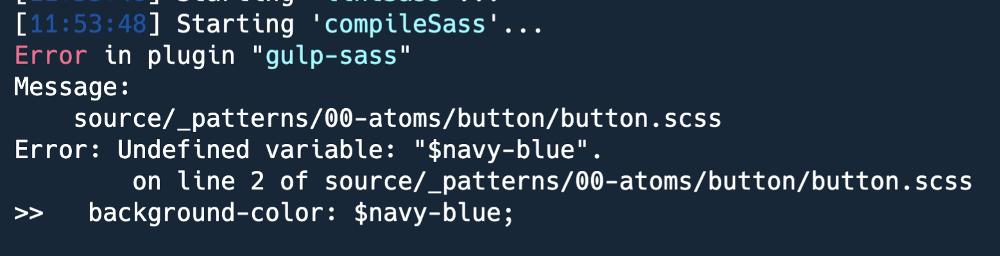

# Exercise 2.6

### Improving our CSS

So now that we have functioning Sass in our project, let's improve the CSS we've written thus far so that we take advantage of some of the features of Sass.

#### Button Styles



```css
.button {
  background-color: #003954;
  border: 2px solid #003954;
  color: #ffffff;
  display: inline-block;
  font-size: 16px;
  line-height: 1.3;
  padding: 15px 40px;
  text-transform: uppercase;
  text-decoration: none;
}

.button:hover,
.button:focus {
  color: #ffffff;
}

.button.button--ghost {
  background-color: transparent;
  border: 2px solid #444444;
  color: #444444;
  padding: 8px 30px;
}

.button.button--ghost:hover {
  color: #444444;
}
```



Looking at the current button's styles above, we can see that we're using several colors.  The interesting thing is that most colors are repeated multiple times.  This means, if for some reason our project's colors changed, the button alone will require several updates.  This is a problem that could lead to inconsistencies across elements or components, and it is also a concern for styles regressions.

As we saw earlier, wit Sass we can use variables which not only will address the concerns above, but it will also simplify maintenance of colors. Rather than updating multiple elements, components or pages, we will be able to update our colors in one place, and those changes will reflect anywhere where the variables are used.

### Color variables

#### Using existing color variables

Pattern Lab out of the box provides a basic system for managing Sass variables.  We will take advantage of this system to add, update, or use  with our own colors.

1. In your editor, open `source/css/scss/generic/_variables.scss`
2. First, see if any of the colors' hex codes shown above, exist in **\_variables.scss** colors section
3. If you find a matching hex code, copy the variable name from **\_variables.scss** \(variable names start with a dollar sign \( `$` \), and paste it into **button.scss** by replacing the corresponding hex code with the variable name.   **Example:** The hex code `#ffffff` in **button.scss** exists in **variables.scss** and its variable name is `$white`.  This means in **button.scss** any instance of this color will look like this: `color: $white;`
4. Repeat this process with any other hex codes that exist in both files.

#### Creating or updating color variables

After you updated any hex codes in **button.scss** with variables from **\_variables.scss**, let's now work on creating new color variables for those hex codes that do not exist in __**\_variables.scss**.

1. Let's start with the navy blue color used as the button's background color \(hex code `#003954`\).  This color is used twice in **button.scss**.
2. Add the following code as the first item in the colors section in **\_variables.scss**



```css
$navy-blue : #003954;
```



1. Now in **button.scss**,  replace `#003954` with `$navy-blue`

#### Updating existing color variables

1. The dark gray color in **button.scss**, hex code `#444444`  although is does ot exist in **variables.scss**, can be used to replace the existing `$gray-dark` variable's value.  
2. Replace the hex code for `$gray-dark` in **variables.scss** with `#444444` 
3. Now in **button.scss** replace `#444444` with `$gray-dark`

Since our desings already have pretty well-defined colors, it makes sense that the **$gray-dark** variable uses our color.  Otherwise we would need to create a new variable while $gray-dark may go without eing used since that particular color is not part of our designs.

#### ERRORS!!!! 😱



If you had `npm run watch` running when you saved all your changes to **button.scss** and **variables.scss**, you probably see some errors similar to to the one above.  No worries, you haven't done anything wrong.  We just need to do one more thing for our new color variables to work properly.

#### Importing the variables

In Sass, we can create all the variables we want, but before we can use them we need to make them available in the files where we want to use them.  This is done by using a Sass `@import` directive.

1. In **button.scss**, add the following code at the very top of the file, then save your changes



```css
// Import Sass variables.
@import '../../../css/scss/generic/variables';
```



* Your gulp task should have recompiled the Sass code again and the error above should no longer appear.
* The import directive above is basically making **button.scss** aware of the **variables.scss** [Sass partial](https://dev.to/sarah_chima/using-sass-partials-7mh).


**IMPORTANT**: the `@include` directive above is not in anyway related to Twig's include statements


#### Final Button Styles

* After all the changes, **button.scss** should now look like this:



```css
// Import Sass variables.
@import '../../../css/scss/generic/variables';

.button {
  background-color: $navy-blue;
  border: 2px solid $navy-blue;
  color: $white;
  display: inline-block;
  font-size: 1.6rem;
  line-height: 1.3;
  padding: 15px 40px;
  text-transform: uppercase;
  text-decoration: none;

  // Hover and focus states for base button
  &:hover,
  &:focus {
    color: $white;
  }

  // Styles for white button with gray outline.
  &.button--ghost {
    background-color: transparent;
    border: 2px solid $gray-dark;
    color: $gray-dark;
    padding: 8px 30px;

    // Hover and focus styles for ghost button.
    &:hover,
    &:focus {
      color: $gray-dark;
    }
  }
}
```



#### Updating Pattern Lab's Color Palette Atom

Pattern Lab provides a nice color palette component which is great to set a project's branding colors.  You can find the color palette under **Atoms &gt; Global**, in Pattern Lab.

Since we added and updated colors in **variables.scss**, we should update the color palette component so the colors in it reflect our actual colors.

1. In your editor, open `source/_patterns/00-atoms/01-global/00-colors.twig`
2. Add the following list item as its first item



```php
<li>
	<span class="sg-swatch" style="background: #003954;"></span>
	<span class="sg-label">#003954</span>
</li>
```



1. Now find the original value for `$gray-dark` in `00-colors.twig`, and replace it with `#444444`.  Keep in mind there are two places within the list item where the changes need to be made.  See code above for example.
2. As we update our color variables further, we will repeat all the steps on this page to ensure our changes are being captured everywhere in Pattern Lab.  This is a recommended practice to ensure the fidelity of our styleguide in Pattern Lab.  If we don't make an effort to properly maintain our preferences, the styleguide will be out of sync and this could lead to issues in our projects.

### Sass Partials

A [Sass partial ](https://dev.to/sarah_chima/using-sass-partials-7mh)is simply a Sass file preceded by an underscore. An example is `_variables.scss`. The underscore tells Sass that the file is a partial and that it should not be compiled to CSS. This partial can then be imported into another file that will be compiled to CSS. Depending on the way you want to structure your Sass project, a partial can contain all variables used in your project, functions or mixins or it might be for specific pages or components of your pages.

Throughout this training we will create or work with other Sass partials.  For example, we will use the `_mixins.scss` partial later on.

### Repeat with heading.scss and hero.scss

In the interest of time, I have updated `heading.scss` and `hero.scss` .  Copy the updated code below into each of the respective files in your project.



```css
@import '../../../css/scss/generic/variables';

.heading {
  color: $gray-dark;
}

// Removes underline when headings are links.
.heading a {
  text-decoration: none;
}

// Styles for extra large headings.
.heading.heading--large {
  color: $gray-dark;
  font-size: 4rem;
  text-align: center;

  @media screen and (min-width: $bp-small) {
    font-size: 6rem;
  }

  @media screen and (min-width: $bp-med) {
    font-size: 8rem;
  }

  @media screen and (min-width: $bp-xxl) {
    font-size: 10rem;
  }
}
```





```css
@import '../../../css/scss/generic/mixins';
@import '../../../css/scss/generic/variables';

.hero {
  @include image-crop (300px);

  @media screen and (min-width: $bp-med) {
    height: 400px;
  }

  @media screen and (min-width: $bp-xl) {
    height: 600px;
  }

  @media screen and (min-width: $bp-xxl) {
    height: 700px;
  }

  // Styles heading when inside the hero.
  .heading {
    color: $navy-blue;
    font-weight: 900;
    margin-bottom: 10px;
    text-transform: uppercase;

    @media screen and (min-width: $bp-med) {
      margin-bottom: 25px;
    }

    @media screen and (min-width: $bp-xl) {
      margin-bottom: 50px;
    }
  }
}

.hero__content {
  position: absolute;
  text-align: center;
  top: 20%;
  width: 100%;

  @media screen and (min-width: $bp-med) {
    top: 22%;
  }

  @media screen and (min-width: $bp-xl) {
    top: 35%;
  }
}
```



WHAT'S ALL THIS? 😳

The Hero styles have changed big time.  What's going on?

* We have two `@import` directives at the very top of hero.scss.  This means that in addition to importing variables, we are also importing the mixins partial.  Why?
* If you notice on line 5, we are using a mixin \(`@include image-crop(300px)`\).  We briefly discussed mixins earlier.  Mixins allow us to write code we can reuse anywhere and also provide an option to pass parameters or values to the code.  So in this case we are using the **image-crop** mixin \(we will create it shortly\), which allow us to crop an image and assign a fixed height.  We are doing this so the hero image on mobile devices does not look super tiny if we simply let it scale down naturally.
* Notice that following the mixin we see some blocks of code like this:



```css
@media screen and (min-width: $bp-med) {
  height: 400px;
}
```



* This code above is known as a [Media Query](https://www.w3schools.com/css/css_rwd_mediaqueries.asp), and this is a technique to style websites so they work on any device such as mobile devices, tablets, laptops, desktops, TVs, etc.
* Notice the part `$bp-med` in the code above.  This is a variable provided by Pattern Lab that has a pixel or em value and can be used to detect how big or small a device is when viewing our website.
* In the example above, we are basically saying "_If this is a screen device and its width is at least 750px or bigger, set the hero's image height to 400px_".  Following that code is another media query where we check if the device's width is at least 1150px, and if so, we increase the height of the hero image to 600px. And so on.  Check in **\_variables.scss** and you will find a collection of variables for **Breakpoints.**  Breakpoints are predefined parameters for a device width.
* But what does **em** mean?  and how does that translate to pixels?  EMs are a relative/resizable unit that is popular when working with [Responsive Web Design](https://learn.shayhowe.com/advanced-html-css/responsive-web-design/).
* There are tools that let you convert EMs to Pixels, and vice versa.  Here's [an example of one](https://www.w3schools.com/css/css_rwd_mediaqueries.asp).
* Wow, that's a lot of information to make sense of.

#### Create the image crop mixin

1. In your text editor, open `source/css/scss/generic/_mixins.scss`
2. Add the following code at the bottom of the file:



```css
// Center crop image
@mixin image-crop($height: 100%) {
  height: $height;
  overflow: hidden;
  position: relative;
  width: 100%;

  img {
    height: 100%;
    left: 50%;
    max-width: none;
    position: absolute;
    top: 50%;
    transform: translate(-50%, -50%);
    width: auto;
  }
}
```



* This mixin basically visually crops an image by calculating the width of the image based on the fixed height we assign.
* Anything outside the width and height boundaries, is hidden by using `overflow: hidden;`

While we are at it, let's create another mixin to perfectly center-align the Hero title and button.



```css
// vertical align mixin
@mixin vertical-align($position: relative) {
  display: block;
  position: $position;
  top: 50%;
  transform: translateY(-50%);
}

// horizontal align mixin
@mixin horizontal-align($position: relative) {
  display: inline-block;
  left: 50%;
  position: $position;
  transform: translateX(-50%);
}

// center align mixin
@mixin center-align($position: relative) {
  display: block;
  left: 50%;
  position: $position;
  top: 50%;
  transform: translate(-50%, -50%);
}
```



* These are technically 3 mixins.  One to align things horizontally, vertically, and the other one to align things both vertically and horizontally.  
* These are great to easily center align any element.  We will use this with the Hero text.

### Align the Hero text with new mixins

1. In your editor, open `source/_patterns/01-molecules/hero/hero.scss`
2. Update the styles for the `.hero__content` selector only, as shown below:



```css
.hero__content {
  @include center-align(absolute);
  text-align: center;
  width: 100%;
}
```



### Pattern Lab's responsive breakpoints

1. In your command line tool, if you have any commands running, press **Ctrl + C** to stop the commands
2. Start Pattern Lab and Gulp again by running each command below in separate terminal windows

```bash
npm start

npm run watch
```

* Look at the hero in Pattern Lab and using the response breakpoints toggles, view the Hero in mobile, tablet, laptop and desktop view.
* You should see the hero image height changing while the title and button always remain perfectly centered.

