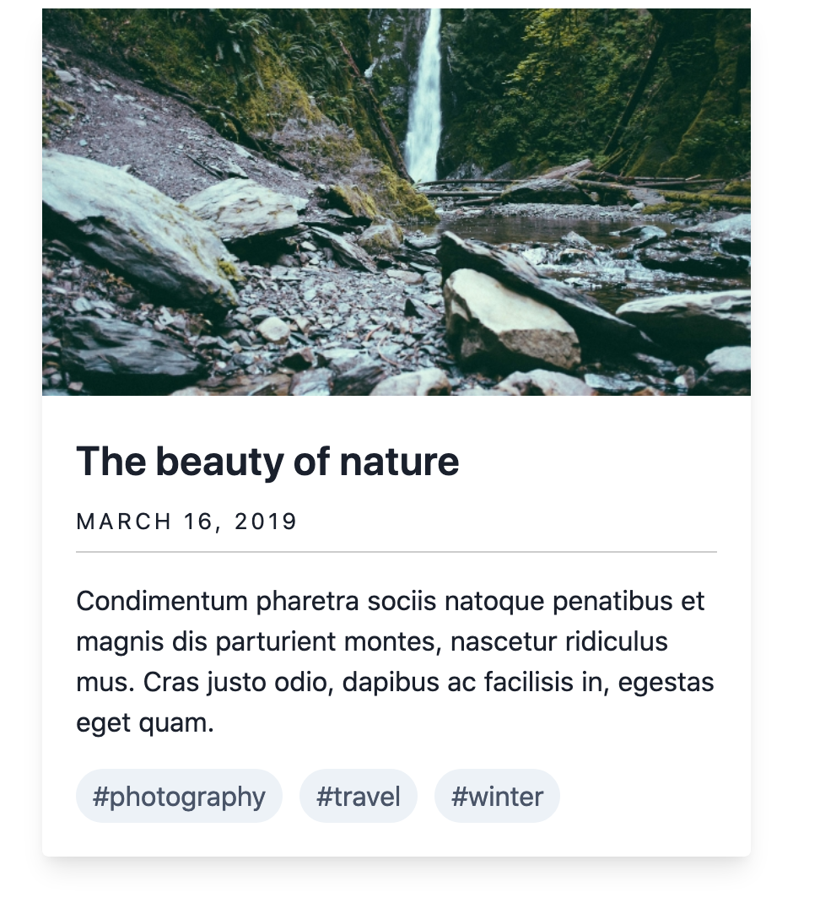

# Exercise 3

## Card

The next component we will build is the **Card** component. A Card component is a pretty common component on most website because they are perfect for displaying specific type of content. Typically you will see cards in a group to show things like Latest News, Latest Events, etc.



### Building the Card

One of the first things we need to do is define the data fields that makeup the component. If you look at the image above, a single Card has the following data fields:

* image
* title \(link to full article\)
* date
* body
* & tags

Let's start building the Card.

#### Component's stock content

1. Inside _s_`ource/_patterns/01-molecules` create a new directory called **card**
2. Inside the _card_ directory create a new file called **card.json**
3. Inside `card.json` add the following code:



```yaml
{
  "image": "",
  "title": {
    "heading_level": "2",
    "modifier": "card__title",
    "title": "Level up your game",
    "url": "#"
  },
  "date": "March 16 2020",
  "body_text": "Curabitur blandit tempus porttitor. Vestibulum id ligula porta felis euismod semper. Vivamus sagittis lacus vel augue laoreet rutrum faucibus dolor auctor. Aenean lacinia bibendum nulla sed consectetur.",
  "tags": [
    {
      "text": "Photography",
      "url": "#"
    },
    {
      "text": "Sports",
      "url": "#"
    },
    {
      "text": "Outdors",
      "url": "#"
    }
  ]
}
```



Most fields above are pretty straight forward.

* For the `title` we created an object so we can group all title-related properties together
* For `tags`, we are using an array. An array is a list of items all with the same or similar properties. Each tag item inside the array has a text and URL keys
* the `body_text` field can be thought of as a wysiwyg type of field where you type body text
* The other fields are pretty straight forward and we have seen them in previous components.

#### Component's markup

1. Inside the _card_ directory create a new file called **card.twig**
2. Inside `card.twig` add the following code:



```php
<article class="card">
  
    <div class="card__media">
      {{ image }}
    </div>
  
  
  <div class="card__content">
    
      
    
    
      <div class="card__eyebrow">{{ date }}</div>
    
    
      <p class="card__body-text">
        {{ body_text }}
      </p>
    
    
      <ul class="card__tags--items">
        
          <li class="card__tag--item">
            <a href="{{ item.url }}" class="card__tag--link">
              {{ item.text }}
            </a>
          </li>
        
      </ul>
    
  </div>
  
</article>
```



* Just as we did with previous components, we are first checking if there is content to render before declaring the fields and their wrappers
* We are re-using the **heading** component by using an `@include` as we did in the Hero component.
* With the tags we loop through the `tags` array and then add each tag item as a list item \(`<li>`\), in the unordered list.  Using `<ul>...</ul>` for listing of content like this is best practice.  Inside each list item we add a `<a>` tag where we pass the `url` and the text properties of each tag.
* Just as we did with the Hero and other components, we are using BEM to name the CSS classes.  We are also setting a namespace for this component by naming each class with `card__*`

#### Component styles

Alright, now it's time to put our new Gulp-driven workflow to work.

1. Inside the _card_ directory create a new file called **card.scss \(note it is SCSS, not CSS\)**
2. Inside `card.scss` add the following code:



```css
@import '../../../css/scss/generic/variables';

.card {
  box-shadow: 0 10px 15px -3px rgba($black, 0.1), 0 4px 6px -2px rgba($black, 0.05);
  display: flex;
  flex: 0 0 auto;
  flex-direction: column;
  max-width: 320px;
  position: relative;

  img {
    display: block;
    width: 100%;
  }

  @media screen and (min-width: $bp-med) {
    flex: 0 0 45%;
    max-width: 325px;
  }

  // ========== Card wide styles=========
  &.card--wide {
    border: 1px solid $gray-lighter;
    box-shadow: none;
    flex-direction: column;

    .card__body-text {
      margin-bottom: 20px;
    }

    // Changes card layout on larger screens.
    @media screen and (min-width: $bp-small-3) {
      flex-direction: row;
      max-width: 720px;

      .card__media {
        flex: 0 0 30%;
      }

      .card__content {
        flex: 0 0 70%;
      }

      img {
        max-width: 100%;
      }
    }
  }

  .button--ghost {
    display: block;
    margin: 0 auto;

    @media screen and (min-width: $bp-small-3) {
      display: inline-block;
      margin: 0;
    }
  }
}

.card__content {
  padding: 20px;
}

.card__title {
  font-size: 24px;
  font-weight: 600;
  margin-bottom: 8px;
  margin-top: 0;
}

.card__date {
  border-bottom: 1px solid $gray-med;
  display: block;
  letter-spacing: 2px;
  text-transform: uppercase;
  padding-bottom: 8px;
}

.card__tags--items {
  display: flex;
  list-style: none;
  margin: 0;
  padding: 0;
}

.card__tag--item {
  background-color: $catskill-white;
  border-radius: 99999px;
  color: $gray-dark;
  display: inline-block;
  margin-right: 10px;
  padding: 4px 10px;
}

.card__tag--link {
  color: lighten($gray-dark, 25%);
  text-decoration: none;

  &:hover,
  &:focus {
    color: $gray-dark;
  }
}
```



#### Updating color variables

You may have noticed the color values in **card.scss** are using variables.  Most of the variables in **card.scss** already existed from our previous exercise or they were provided by Pattern Lab.  However, I made some adjustments to variables and also added new ones.

1. In your editor, open `source/css/scss/generic/_variables.scss`
2. Updated the entire color section as shown below:



```css
//Colors
$navy-blue : #003954;
$gray-light : #eee;
$gray-lighter : #ddd;
$gray-med : #ccc;
$gray : #808080;
$gray-dark : #444;
$gray-darker : #131313;
$white : #fff;
$catskill-white : #edf2f7;
$black : #000;
$dim : rgba(0,0,0,0.5);
$error : #f00;
$valid : #089e00;
$warning : #fff664;
$information : #000db5;
```



#### Update the color palette in Pattern Lab

1. Copy all the code below and paste it inside `source/_patterns/00-atoms/01-global/00-colors.twig`



```php
<ul class="sg-colors">
	<li>
		<span class="sg-swatch" style="background: #003954;"></span>
		<span class="sg-label">#003954</span>
	</li>
	<li>
		<span class="sg-swatch" style="background: #eeeeee;"></span>
		<span class="sg-label">#eeeeee</span>
	</li>
	<li>
		<span class="sg-swatch" style="background: #dddddd;"></span>
		<span class="sg-label">#dddddd</span>
	</li>
	<li>
		<span class="sg-swatch" style="background: #cccccc;"></span>
		<span class="sg-label">#cccccc</span>
	</li>
	<li>
		<span class="sg-swatch" style="background: #808080;"></span>
		<span class="sg-label">#808080</span>
	</li>
	<li>
		<span class="sg-swatch" style="background: #444444;"></span>
		<span class="sg-label">#444444</span>
	</li>
	<li>
		<span class="sg-swatch" style="background: #131313;"></span>
		<span class="sg-label">#131313</span>
	</li>
	<li>
		<span class="sg-swatch" style="background: #000000;"></span>
		<span class="sg-label">#000000</span>
	</li>
	<li>
		<span class="sg-swatch" style="background: #ffffff;"></span>
		<span class="sg-label">#ffffff</span>
	</li>
	<li>
		<span class="sg-swatch" style="background: #edf2f7;"></span>
		<span class="sg-label">#edf2f7</span>
	</li>
	<li>
		<span class="sg-swatch" style="background: #ff0000;"></span>
		<span class="sg-label">#ff0000</span>
	</li>
	<li>
		<span class="sg-swatch" style="background: #00ff00;"></span>
		<span class="sg-label">#00ff00</span>
	</li>
	<li>
		<span class="sg-swatch" style="background: #ffff00;"></span>
		<span class="sg-label">#ffff00</span>
	</li>
	<li>
		<span class="sg-swatch" style="background: #0000ff;"></span>
		<span class="sg-label">#0000ff</span>
	</li>
</ul>
```



#### Compiling the code

After saving the changes above Pattern Lab should had reloaded. If not run:

```text
npm start
```

Since the new Gulp workflow is separate from Pattern Lab's compiling tasks, we need to run both tasks simultaneously \(`npm start` and `npm run watch` \). Pattern Lab's task watches for any Twig or JSON changes, while our new Gulp task watches any changes we make to Sass files and compiles them to CSS. Let's take a look at how we can do this in VS Code and Outside of VS Code for those not using VS Code.

#### Running Gulp and Pattern Lab together from VS Code \(Ignore the remaining of this page if you already did this in the previous exercises\).

1. In VS Code, open the command line tool \(**View &gt; Terminal**\).  You will most likely have Pattern Lab running, otherwise type `npm start` and press **Return**
2. With Pattern Lab running in your command line, press **Cmd + \** or click **Terminal &gt; Split Terminal** \(from VS Code's toolbar\).  You should now have two terminal tabs in which you can run different commands.
3. In the second tab, type the following command and press **Return**

```text
npm run watch
```

#### Running Gulp and Pattern Lab together from Outside VS Code

If you have opted to use a command line tool that it's not in VS Code \(Terminal or PowerShell\), or, if you are not using VS Code as your editor, follow these steps:

1. Open your command line tool.  You will most likely have Pattern Lab running, otherwise type `npm start` from within the **components\_project** directory, and press **Return**
2. Press **Cmd + T** \(**Ctrl + T** in Windows\), or Look in the toolbar of your command line tool and find the option to open a new tab.
3. In the second tab, type the following command and press **Return**

```text
npm run watch
```

If you look in Pattern Lab, you will find an styled Card component under the **Molecules** dropdown in Pattern Lab's main navigation.

