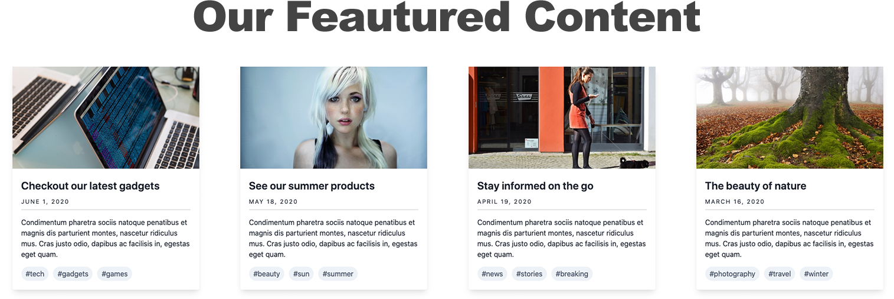

# Exercise 4

## Featured Content list

So far we've been building individual components and built them in a way we can re-use them. Well, the time has come to build a list of content where we will re-use most components we've built. This is where component-based shines. By looking at the design comp below, we can see that we will be showing a collection of cards. In addition, the section has a title or heading of "Our Featured Content" and a Call To Action button to see more content.



### Let's start

First, we will switch back to using global content for this and next components by using `data.json`. Doing this will allow us to have a centralized place for all content which will save us time and effort. The recommendation for individual components is to have the data, markup and styles in the same directory as we've done thus far with most components. For prototypes like this or the page we will build later, it makes more sense to have the data we need in a single place. This will save us time and reduce duplication of data.

#### Building the global data

1. In your text editor open `source/_data/data.json`
2. Scroll to the end of the file and before the last curly bracket \( } \), add a comma and press **Return**
3. Copy the code below and paste it in the empty space you just created in the previous step.  Ensure the indentation of the newly added code matches the current indentation in the file. 



```yaml
"featured": {
  "heading": {
    "heading_level": "2",
    "modifier": "heading--large",
    "title": "Our Featured Content",
    "url": ""
  },
  "items": [
    {
      "image": "",
      "title": {
        "heading_level": "3",
        "modifier": "featured-content__title",
        "title": "Staying healthy",
        "url": "#"
      },
      "date": "March 16 2020",
      "body_text": "Curabitur blandit tempus porttitor. Vestibulum id ligula porta felis euismod semper. Vivamus sagittis lacus vel augue laoreet rutrum faucibus dolor auctor. Aenean lacinia bibendum nulla sed consectetur.",
      "tags": [
        {
          "text": "Phtography",
          "url": "#"
        },
        {
          "text": "Nature",
          "url": "#"
        },
        {
          "text": "Outdors",
          "url": "#"
        }
      ],
      "modifier": "featured-content__card"
    },
    {
      "image": "",
      "title": {
        "heading_level": "3",
        "modifier": "featured-content__title",
        "title": "Tech gadgets",
        "url": "#"
      },
      "date": "March 16 2020",
      "body_text": "Curabitur blandit tempus porttitor. Vestibulum id ligula porta felis euismod semper. Vivamus sagittis lacus vel augue laoreet rutrum faucibus dolor auctor. Aenean lacinia bibendum nulla sed consectetur.",
      "tags": [
        {
          "text": "Phtography",
          "url": "#"
        },
        {
          "text": "Nature",
          "url": "#"
        },
        {
          "text": "Outdors",
          "url": "#"
        }
      ],
      "modifier": "featured-content__card"
    },
    {
      "image": "",
      "title": {
        "heading_level": "3",
        "modifier": "featured-content__title",
        "title": "The little things",
        "url": "#"
      },
      "date": "March 16 2020",
      "body_text": "Curabitur blandit tempus porttitor. Vestibulum id ligula porta felis euismod semper. Vivamus sagittis lacus vel augue laoreet rutrum faucibus dolor auctor. Aenean lacinia bibendum nulla sed consectetur.",
      "tags": [
        {
          "text": "Phtography",
          "url": "#"
        },
        {
          "text": "Nature",
          "url": "#"
        },
        {
          "text": "Outdors",
          "url": "#"
        }
      ],
      "modifier": "featured-content__card"
    },
    {
      "image": "",
      "title": {
        "heading_level": "3",
        "modifier": "featured-content__title",
        "title": "All the arts",
        "url": "#"
      },
      "date": "March 16 2020",
      "body_text": "Curabitur blandit tempus porttitor. Vestibulum id ligula porta felis euismod semper. Vivamus sagittis lacus vel augue laoreet rutrum faucibus dolor auctor. Aenean lacinia bibendum nulla sed consectetur.",
      "tags": [
        {
          "text": "Phtography",
          "url": "#"
        },
        {
          "text": "Nature",
          "url": "#"
        },
        {
          "text": "Outdors",
          "url": "#"
        }
      ],
      "modifier": "featured-content__card"
    }
  ]
},
```



* The code above is simulating all the content needed to create the **Featured Content** list.  This list is an Organism in the context of Atomic Design because it combines multiple molecules \(cards\).
* Just like we did with other components, we have created a data object for the list, this is called **featured**.  Doing this will make it possible to retrieve content more easily for the list.
* Within the "featured" object, we first declare the **heading** object to print the section's heading "Our Featured Content".
* Next we create an array of content called **items**
* Inside the `items: [ ]` array, we will add the number of cards we need in our Featured Content list.  From the design above we need 4 cards.  Each item in the array is enclosed in curly brackets\( `{...}` \).
* Inside the curly brackets we declare the same fields found in `card.json` and we repeat this 4 times.

### Creating the list of content in Twig

Now that the Featured Content data is ready, its time to write the code that will make it possible to display the list in Pattern Lab. With all that data above you would think the twig code will be just as involved. Think again.

1. Inside `source/_patterns/02-organisms` create a new directory called **featured-content**
2. Inside _featured-content_ create a new file called `featured-content.twig`
3. In _featured-content.twig_ add the following code:



```php
<section class="featured-content">
  

  <div class="featured-content__items">
    
      
    
  </div>
</section>
```



* We start with a `<section>...</section>` tag with the class of `featured-content`
* First we do an `@include` for the heading atom and then we match the `heading` object from the heading component with `featured.heading` in data.json.  Since our data structure in data.json uses an object of `featured: { }`, any item we want to reference from the object will need to be filtered down by using `featured` then a dot \( `.` \), delimiter and the name of the item \(i.e. `featured.heading`\)
* Next we open up a new wrapper to hold the cards \(`<div class="featured-content__items">...</div>` \)
* Inside the new wrapper, we use Twig's loop statement to loop through the `items` array
* For each item in the array \(i.e. `for item in featured.items`\), we include a card component.  A `for` loop will repeat itself as many times as the number of items in the array and will add a card each time.  As a result, we will end up with 4 cards.
* Notice how little Twig code we had to write to build an entire section of content.  Twig is great for this kind of things. We could even reduce the code even more but don't want to get too greedy 😃.  This is what we mean when we say "reduce code duplication".  Notice how we are not writing any html for the heading or the cards.  All the code comes from the components and here we are only referencing them.  Gold, Jerry, Gold! 📺 🎭

#### Writing CSS styles for the list

Now the final step is to style the list. You can only imagine how much CSS we would need to write to make things look like the design above.

1. In `source/_patterns/02-organismss` create a new file called `featured-content.scss`
2. In featured-content.scss add the following code:



```css
@import '../../../css/scss/generic/mixins';

.featured-content__items {
  display: flex;
  justify-content: space-around;
}

.featured-content__card {
  flex: 0 0 22%;
  max-width: 400px;
}
```



How cool is it that we only need this little CSS? Since the cards have already been individually styled, the CSS above simple addresses the layout and alignment of the list of cards.

#### Pattern Lab time

If Pattern Lab is running you can look in **Organisms** from Pattern Lab's main navigation and see the Featured Content section. Otherwise run:

```text
npm start
```

