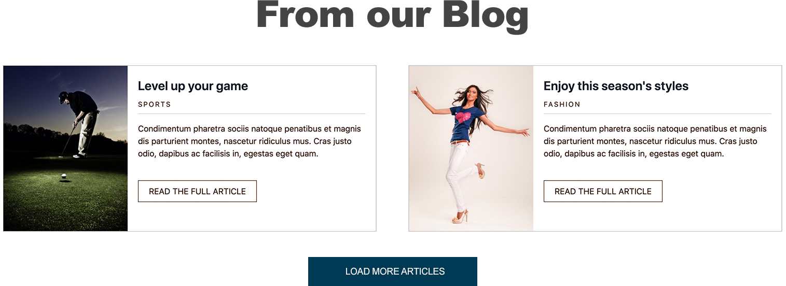

# Exercise 4.1

## Blog Content List

Now build the next list of content as shown in the image below.

* Repeat the same steps from the Featured Content List
* In `data.json` use the object name of `blog`
* Remember some of the fields in the Blog list cards are different and the cards use the "Card wide" variant.



Here are the styles you can use for the blog content



```css
@import '../../../css/scss/generic/mixins';

.blog-content {
  @include component-spacing;
}

.blog-content__items {
  display: flex;
  justify-content: space-around;
}

.blog-content__cta {
  margin: 50px auto;
  text-align: center;
}

/** This can be placed elsewhere. **/
.footer {
  margin-top: 80px;
  background-color: #000000;
  height: 100px;
}
```



