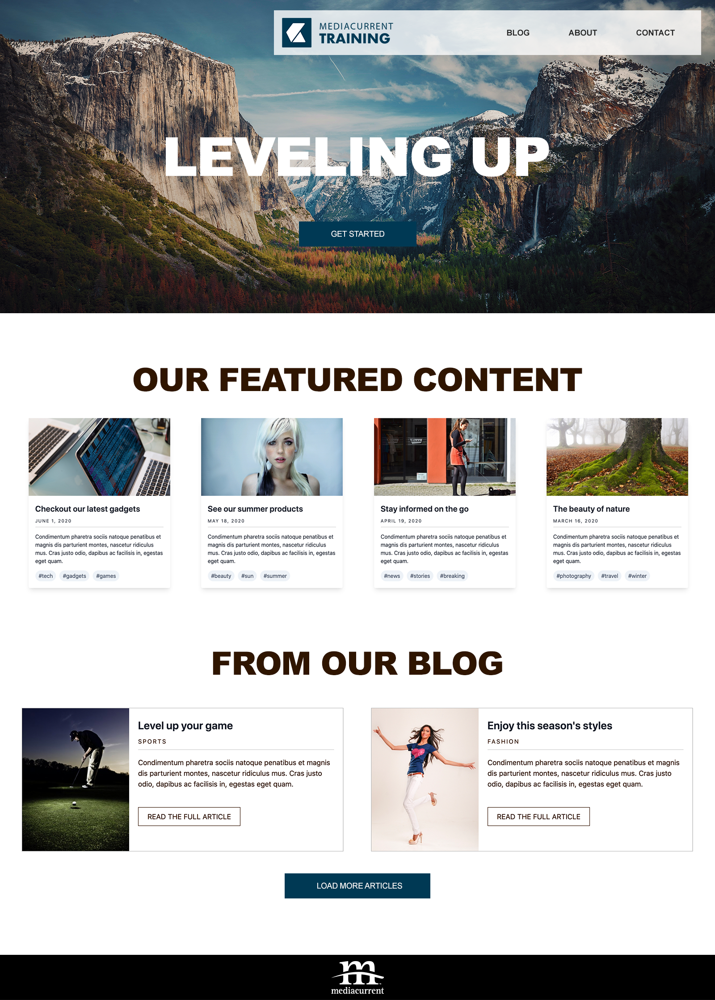

# Exercise 5

### Homepage prototype



Is now time to put all the pieces together to build the homepage shown above.  Building prototype pages in Pattern Lab is a great way to demo to stakeholders and team members the end product of a project.  This is particularly useful for testing.

Building the page will be relatively easy because all we need to do is include all the components we already built.  In addition, a lot of the data/content the components need has already been written with the exception of some components.  Let's start.

### Demo content

Since we already created sample data in `data.json` for the Featured Content and Blog Content sections in the previous two exercises,  we can reuse it for the homepage.  We just need to add data for the Hero component in `data.json`.  Let's do that now.

1. In your text editor, open `soource/_data/data.json`
2. Just before `"featured": {` add the following code and save your changes:



```yaml
"hero_new": {
  "image": "",
  "heading": {
    "heading_level": "1",
    "modifier": "hero__title heading--large",
    "title": "Leveling Up",
    "url": ""
  },
  "cta": {
    "text": "Get started",
    "url": "#",
    "modifier": "hero__cta"
  }
}
```




**WARNING**:  Ensure you are using/matching the file's indentation preferences for code \(i.e. 2 spaces\).  In addition, as we saw in the [JSON Basics](../basics/json-basics.md) section, ensure you adhere to JSON's punctuation rules \(i.e. commas between each data objects except on the last item.


* As you can see above, we are creating an object for the Hero component called **hero\_new**.  Why hero\_new? you may ask yourself.  If you look in `data.json` you will find that there is a `hero:` key.  Rather than overriding the existing key and risking breaking patterns that may already be using it, we're starting with a new object.
* The data structure above was copied from the Hero component we built.

### Building the Twig template for homepage

Now that we have all the data we need, let's build the Twig template that will become our new homepage.  As we did with the components we built, we will be using our own naming convention by excluding the numeric prefixes found in patterns provided by Pattern Lab.  This is only a personal preference and you are welcome to use Pattern Lab's naming convention if that suits you better.

#### Adding the Hero component

1. Inside `source/_patterns/04-pages/` create a new file called **homepage.twig**
2. In _homepage.twig_ write the following code to add the Hero component to the page:



```php

```



* Notice how we are only including the **hero** component and mapping its fields to the fields/keys in `data.json`.  We are not writing any HTML.  Since we built the Hero and all other components as their own independent entities, they will look and behave the same regardless of where we use them.

If you save your changes and you have Pattern Lab running you should see a new item under "Pages" in the main navigation called **Homepage**.  Clicking Homepage should display a new page with a hero in it.

If Pattern Lab was not running run `npm start` to start it.

#### Adding the Featured Content List component

When we built the Featured Content List component we added its data to `data.json`.  This means we don't have to do anything for data anymore.  All we have to do now is include that component in `homepage.twig` and map its fields accordingly.

1. In _homepage.twig_ write the following code and save your changes:
2. For readability, you may want to leave an empty line in between each component's include.



```php

```



This include statement above is much different and simpler.  Since the data for Featured Content List was originally created in `data.json`, Pattern Lab is smart enough to automatically retrieve all the keys and values.  This eliminates the need to map each field as we did with the Hero.

Pattern Lab should now show in addition to Hero, the Featured Content component.  Don't worry about the spacing around the components for now.  We'll address that shortly.

#### Adding the Our Blog List component

Go ahead and add the last component on your own.  This will be similar to the Featured Content List above.

### Styling the Homepage

Although we could create a stylesheet to style the homepage so it matches our design comps, sometimes is better to take a step back and think about the requirements for our site.  Normally you would not build a one-page website \(although is not unusual for landing pages, brochure-like sites\), but if you are working on a typical project where there will be several landing pages like the one we're building, and especially if those pages will use the components we've built, it is best to look at a global approach to styling those pages.

There are several ways to address the layout and styling of the homepage.  One method I've used in the past is creating a Sass mixin to add specific spacing around a component \(typically at the bottom of the component\).  If we look at the homepage design comp above we see that the amount of space below each component is the same.  Typically for consistency purposes the spacing will remain the same regardless of where the components are used.  In the event of a change of that spacing for a given component, we can always plan for a fallback to override the original spacing rules.  Let's go with this approach for now.

#### Creating a Sass mixin for components spacing

1. In your text editor, open `source/css/scss/generic/_mixins.scss`
2. At the end of the file add the following code:



```css
@mixin component-spacing($margin: 100px) {
	margin-bottom: $margin;
}
```



* **@mixin** is a keyword used in Sass to group CSS code that will be reused.  This mixin can used pretty much anywhere in our project.  Our plan is to use in components so we can keep consistent spacing around them.
* **component-spacing** is the name of the mixin.  It is a good idea to name mixins with names that make it easy to determine their function.
* **\($margin: 100px\)** are parameters the mixin accepts.  In this example we are using a variable of `$margin` which will allow us to pass a value.  If no value, is provided when use the mixin we are setting a default of 100px.
* **margin-bottoom** is the CSS property where we want to add the value of `$margin`. 

#### Using the component-spacing mxin

1. Edit `source/_patterns/01-molecules/hero/hero.scss`
2. In line 1 add `@import '../../../css/scss/generic/mixins';`
3. Add the new **component-spacing** mixin as the first CSS property to the `.hero` selector.  Like so \(line 4\):



```css
@import '../../../css/scss/generic/mixins';

.hero {
  @include component-spacing;
  ...
}
```



* In line 1 we are importing the **mixins** Sass partial.  This means any mixins in that file will be available for us to use in hero.scss.  If we don't import the mixins first we will get an error that `component-spacing` \(our new mixin\), is not found.
* **IMPORTANT**: the `@include` keyword above is not in anyway related to Twig's include statements


As best practice, mixins should always be added before any other CSS properties as shown above.  This makes it possible to override any mixin properties if needed.


If your Sass watch task is running you should see the hero now has 100px of space at the bottom.  If Sass watch was not running type `gulp watch` and reload Pattern Lab.

